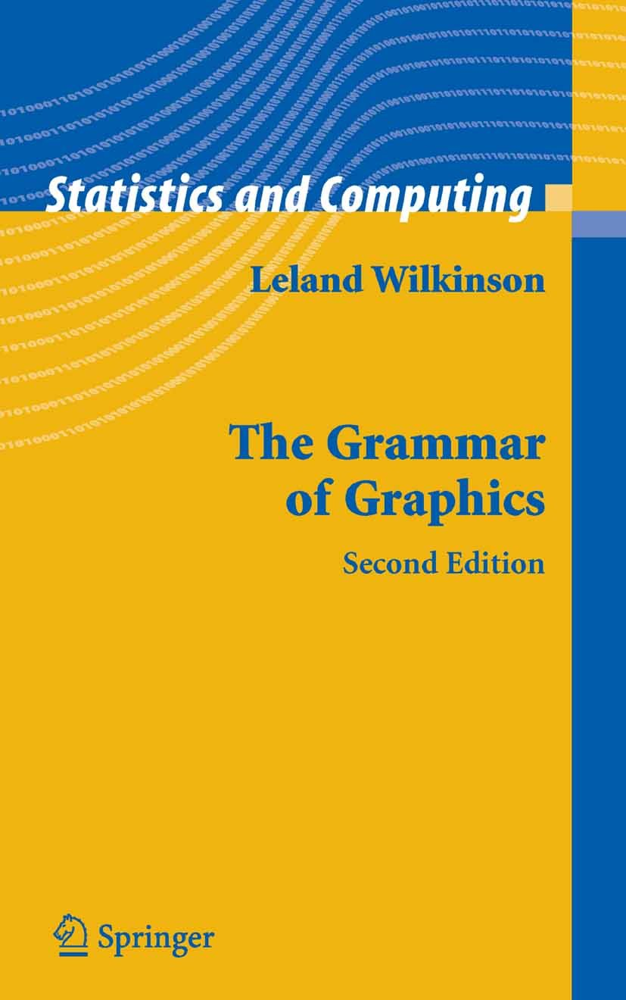

```{r setup, include=FALSE}
knitr::opts_chunk$set(warning = FALSE, message = FALSE, 
                      fig.retina = 3, fig.align = "center")
```

```{r packages-data, include=FALSE}
library(dplyr)
library(ggplot2)
```
name: outline
class: title title-inv-7

# Objectives

--

- What is data visualization?

--

- Exploratory Vs Explanatory plots

--

- Visualizaion Components

--

- Telling Stories with Data

--

- The Grammar of Graphics

--

- Application of the Grammar of Graphics with `ggplot`

--

- Introduction to Project 2 (building a dashboard)

---

name: outline
class: title title-inv-7

# References


- .small[A wonderful class taught by Andrew Wheiss from Georgia State University]
  - .small[His class material can be accessed on [his website](https://datavizm20.classes.andrewheiss.com/)]
  - .small[A few of the slides in this lecture borrow directly from his material (I will point out where)]
  - .small[I highly recommend watching the lectures from his site.] 

- .small[Not to double up, but the resources page on the above course is amazing]
  - .small[[Find it here](https://datavizm20.classes.andrewheiss.com/resource/visualization/)]

- .small[Jeff Leek from John's Hopkins taught a course last semester on Data Analysis.] 
  - .small[The course notes from that class are [available online](http://jtleek.com/ads2020/index.html) and are a fantastic resource]


---

name: outline
class: title title-inv-7

# Data Visualization


<iframe src="https://giphy.com/embed/KYh1vSXtcdl0RYgLCR" width="480" height="477" frameBorder="0" class="giphy-embed" allowFullScreen></iframe><p><a href="https://giphy.com/gifs/education-data-naep-KYh1vSXtcdl0RYgLCR"></a></p>

---

name: outline
class: title title-inv-7

# What is data visualization?

> Visualization is a way to represent data, an abstraction of
the real world, in the same way that the written word can be
used to tell different kinds of stories.
>
> -- <cite>Yau, N. Data Points</cite>

---

class: center middle main-title section-title-4

# Exploratory Vs Explanatory plots

---

name: outline
class: title title-inv-7

# Exploratory Plots

- Exploratory plots:  During the exploratory phase of an analysis, you will make
lots of tables and graphical displays to better understand the structure of the
data along with any data quality issues and initial relationships.
  - You will make LOTS of exploratory plots. Usually 100s per project
  - This graphs are usually for your eyes or a select few colleagues
  - These should be quick and dirty. You shouldn't be worried about output formats (PNG vs SVG),
  labels, axes, fonts, etc...
  - Used for gaining insight

---

name: outline
class: title title-inv-7


# Explanatory Plots

- Explanatory plots: These are meant to be shared with your colleagues and importantly decision makers
  - Decision makers often don't spend as much time reading your reports as you think. 
  - Explanatory figures should convey a clear message to the reader (quickly!)
  - You want to produce graphs that help tell a story

---


name: outline
class: title title-inv-7

# Explanatory Plots (cont)

An Explanatory graph has:
  - clear, large axis labels
  - color and size carefully used for communication
  - minimal abbreviations in axis labels and legends shows the data
  - have figure captions with a declarative summary statement and self-sufficient labeling
  - highlights take home messages with titles or annotation

---

name: outline
class: title title-inv-7

# Motivating Example


```{r load-datasaurus-dozen, echo=FALSE}
dozen <- readr::read_delim('C:/Users/joshu/Documents/temp/Sta2453-Sep2020.github.io/lecture-notes-slides-2020/slides/The Datasaurus Dozen/DatasaurusDozen.tsv', delim = '\t')
my_data <- dozen %>% 
  filter(dataset == "dino") %>% 
  select(x, y)
```

--

.pull-left-3.small-code[
```{r head-datasaurus}
head(my_data, 10)
```
]

--

.pull-middle-3.small-code[
```{r summary-datasaurus, highlight.output=1}
mean(my_data$x)
mean(my_data$y)
cor(my_data$x, my_data$y)
```
]

--

.pull-right-3[
&nbsp;

.box-inv-3[Nice Mean!]

&nbsp;

.box-inv-3[Nice Mean!]

&nbsp;

.box-inv-3[No correlation!]
]

---

name: outline
class: title title-inv-7

# Yikes

.center[
<figure>
  
  <figcaption><a href="https://www.autodeskresearch.com/publications/samestats" target="_blank">The Datasaurus Dozen</a></figcaption>
</figure>
]

---

name: outline
class: title title-inv-7

# Raw data is not enough


.box-inv-3.small[Each of these has the same mean, standard deviation, variance, and correlation]

```{r plot-full-dozen, echo=FALSE, fig.dim=c(10, 4), out.width="100%"}
ggplot(filter(dozen, dataset != "bullseye"), aes(x = x, y = y)) +
  geom_point(size = 1) +
  facet_wrap(vars(dataset))
```


---

name: outline
class: title title-inv-7

# Visualization Components

- Visualization maps data to geometry and colour.

- It works because your brain is wired to find patterns, and
you can switch back and forth between the visual and the
numbers it represents.

- Important: You must make sure that the essence of the
data isn’t lost in that back and forth between visual and
the value it represents because if you can’t map back to
the data, the visualization is just a bunch of shapes.

---

name: outline
class: title title-inv-7

# Mapping data to Geometry


.pull-left-3[

.box-inv-1[37]
]

.pull-right-3[

.box-inv-1[75]
]

How many different representations of the data can you come up with?

---
class: inverse, center, middle
background-image: url(comp2.png)
background-size: contain

???
Source:

---
class: inverse, center, middle
background-image: url(comp1.png)
background-size: contain

---
class: inverse, center, middle
background-image: url(comp3.png)
background-size: contain

---
class: inverse, center, middle
background-image: url(comp4.png)
background-size: contain

---
class: inverse, center, middle
background-image: url(comp13.png)
background-size: contain

---
class: inverse, center, middle
background-image: url(comp14.png)
background-size: contain

---
class: inverse, center, middle
background-image: url(comp15.png)
background-size: contain

---
class: inverse, center, middle
background-image: url(comp16.png)
background-size: contain

---
class: inverse, center, middle
background-image: url(comp17.png)
background-size: contain

---

name: outline
class: title title-inv-7

# Telling Stories with Data

--

- Data are represented by numbers and words.

--

- Data is a representation of something in real life.

--

- Statistics and visualization can help tell a story.

--

- It's up to the data scientist, to decide how to tell
that story.


---
class: inverse, center, middle
background-image: url(comp8.png)
background-size: contain

---

name: outline
class: title title-inv-7

# State of the World


Consider the following random facts about the world

- Life expectancy at birth is 70 years
- The literacy rate of youth females ages 15 to 24 is 87
percent
- The gross domestic product is approximately $70 trillion.

.box-inv-3[Q: Should you visualize this data?]

---
class: inverse, center, middle
background-image: url(comp9.png)
background-size: contain


---

name: outline
class: title title-inv-7

# Before Presenting a Visualization:

Ask yourself

--

.box-inv-4[What is your message?]

--

.box-inv-4[Who is your audience?]


--

.box-inv-4[What does your audience need to know?]

- How much control does the audience have over
the presentation?
- How much detail can they get?

---

name: outline
class: title title-inv-7

# Three groups


.box-inv-4[Me, myself, and I]

.box-inv-4[A specific Group]

.box-inv-4[A wide audience]


---
class: inverse, center, middle
background-image: url(comp10.png)
background-size: contain

---

name: outline
class: title title-inv-7

# A specific Audience

0 Your audience should be able to decode your encodings
so that they can understand the data.

- If your audience is already familiar with the background
behind your data or has perhaps even worked with it, the
barriers are lower, but still exist.

- Consider how your audience will examine your work.

---

name: outline
class: title title-inv-7

# Thought exercise

.box-inv-4[We ask this question at all of our interviews:]

- You have just completed an analysis you were tasked with. You 
  have been asked to present your findings to 2 different audiences
  - Some colleagues (data scientists/biostatisticians)
  - Clinicians and Hospital leadership
- What are some things you would consider when structuring your figures/displays
  for the presentations


---

# Though Exercise

- The purposes of the meetings are likely different to begin with:
  - Meeting with colleagues may be to get some input on the work you have done
    - Are my methods okay? My model fits? My conclusions
  - Meetings with clinicians/senior leadership are likely to focus less on nitty 
    gritty details, and more on conclusions. 
- Colleagues are likely more familiar with certain types of diagnostic plots
- Clinicians/leadership may need more hand holding
- Don't forget that you are an expert

---
class: inverse, center, middle
background-image: url(comp11.png)
background-size: contain

---

name: outline
class: title title-inv-7

# Designing for a wider audience

- As your audience grows so do the challenges, such as
the range of data literacy, and familiarity with your data’s
context.
 - Avoid jargon and be sure you explain complex concepts
in a way so that people can relate.
- Usually need to include more labels, legends, and guides

---

name: outline
class: title title-inv-7

# Designing for a wider audience

- Imagine you are a tourist in a new place.
- What do you want a tour guide to tell you?
- It’s your job to point out the direction of interest, provide
background, and make sure you don’t confuse people.

---
class: inverse, center, middle
background-image: url(comp12.png)
background-size: contain

---

name: grammar-of-graphics
class: center middle section-title section-title-4 animated fadeIn

# The Grammar of Graphics

???

Source: [Andrew Wheiss](https://datavizm20.classes.andrewheiss.com/)

---

layout: false
class: bg-full
background-image: url("img/03/minard.png")

???

Source: [Wikimedia Commons](https://upload.wikimedia.org/wikipedia/commons/2/29/Minard.png)

---


# Mapping data to aesthetics

.pull-left.center[

<figure>
  
</figure>

]

.pull-right[

.box-inv-4.medium[Aesthetic]

.box-4[Visual property of a graph]

.box-4.sp-after[Position, shape, color, etc.]

.box-inv-4.medium[Data]

.box-4[A column in a dataset]

]

---

# Mapping data to aesthetics

<table>
  <tr>
    <th class="cell-left">Data</th>
    <th class="cell-left">Aesthetic</th>
    <th class="cell-left">Graphic/Geometry</th>
  </tr>
  <tr>
    <td class="cell-left">Longitude</td>
    <td class="cell-left">Position (x-axis)&emsp;</td>
    <td class="cell-left">Point</td>
  </tr>
  <tr>
    <td class="cell-left">Latitude</td>
    <td class="cell-left">Position (y-axis)</td>
    <td class="cell-left">Point</td>
  </tr>
  <tr>
    <td class="cell-left">Army size</td>
    <td class="cell-left">Size</td>
    <td class="cell-left">Path</td>
  </tr>
  <tr>
    <td class="cell-left">Army direction&emsp;</td>
    <td class="cell-left">Color</td>
    <td class="cell-left">Path</td>
  </tr>
  <tr>
    <td class="cell-left">Date</td>
    <td class="cell-left">Position (x-axis)</td>
    <td class="cell-left">Line + text</td>
  </tr>
  <tr>
    <td class="cell-left">Temperature</td>
    <td class="cell-left">Position (y-axis)</td>
    <td class="cell-left">Line + text</td>
  </tr>
</table>

---

# Mapping data to aesthetics

<table>
  <tr>
    <th class="cell-left">Data</th>
    <th class="cell-left"><code class="remark-inline-code">aes()</code></th>
    <th class="cell-left"><code class="remark-inline-code">geom</code></th>
  </tr>
  <tr>
    <td class="cell-left">Longitude</td>
    <td class="cell-left"><code class="remark-inline-code">x</code></td>
    <td class="cell-left"><code class="remark-inline-code">geom_point()</code></td>
  </tr>
  <tr>
    <td class="cell-left">Latitude</td>
    <td class="cell-left"><code class="remark-inline-code">y</code></td>
    <td class="cell-left"><code class="remark-inline-code">geom_point()</code></td>
  </tr>
  <tr>
    <td class="cell-left">Army size</td>
    <td class="cell-left"><code class="remark-inline-code">size</code></td>
    <td class="cell-left"><code class="remark-inline-code">geom_path()</code></td>
  </tr>
  <tr>
    <td class="cell-left">Army direction&emsp;</td>
    <td class="cell-left"><code class="remark-inline-code">color</code>&emsp;</td>
    <td class="cell-left"><code class="remark-inline-code">geom_path()</code></td>
  </tr>
  <tr>
    <td class="cell-left">Date</td>
    <td class="cell-left"><code class="remark-inline-code">x</code></td>
    <td class="cell-left"><code class="remark-inline-code">geom_line() + geom_text()</code></td>
  </tr>
  <tr>
    <td class="cell-left">Temperature</td>
    <td class="cell-left"><code class="remark-inline-code">y</code></td>
    <td class="cell-left"><code class="remark-inline-code">geom_line() + geom_text()</code></td>
  </tr>
</table>


---

# Troup data

```{r loading_data, echo=F}

library(gridExtra)
library(pander)
library(lubridate)
cities <- read.table("minard/cities.txt",
                     header = TRUE, stringsAsFactors = FALSE)

troops <- read.table("minard/troops.txt",
                     header = TRUE, stringsAsFactors = FALSE)

temps <- read.table("minard/temps.txt",
                    header = TRUE, stringsAsFactors = FALSE) %>%
  mutate(date = dmy(date))  # Convert string to actual date

troops %>% head() 
```


---


# Initial Attempt

```{r, initial_attempt, echo= F}
ggplot(troops, aes(x = long, y = lat, group = group)) +
  geom_path()
```


--- 


# Adding more aesthetics

```{r, eval=T, echo = F}
ggplot(troops, aes(x = long, y = lat, group = group,
                   color = direction, size = survivors)) +
  geom_path()
```


---

# Adding even more aesthetics

```{r, echo =F}
ggplot(troops, aes(x = long, y = lat, group = group,
                   color = direction, size = survivors)) +
  geom_path(lineend = "round") + scale_size(range = c(0.5, 15)) +
  scale_colour_manual(values = c("#DFC17E", "#252523")) + labs(x = NULL, y = NULL)
```

---

# The Code

```{r, eval=F, echo=T}
ggplot(troops, aes(x = long, y = lat, group = group,
                   color = direction, size = survivors)) +
  geom_path(lineend = "round") + 
  scale_size(range = c(0.5, 15)) +
  scale_colour_manual(values = c("#DFC17E", "#252523")) + 
  labs(x = NULL, y = NULL)
```

---

# Implementation of the grammer of graphics

.box-inv-4[ggplot2]