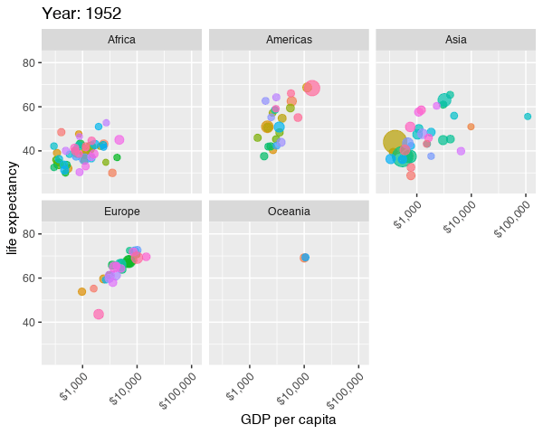

```{r setup, echo=FALSE, cache=FALSE}
library(knitr)
library(rmdformats)

## Global options
options(max.print="75")
opts_chunk$set(echo=T,
	             cache=F,
               prompt=FALSE,
               tidy=TRUE,
               comment=NA,
               message=FALSE,
               warning=FALSE)
opts_knit$set(width=75)
```

## Introduction to the grammar of graphics

```{r, echo=F, warning=F, message=F}
library(tidyverse)
library(flair)
library(ggthemes)
library(knitr)
```

Remember from class that the grammar of graphics is all about a mapping between 
Data and aesthetics, and then adding some geometries to these aesthetics. 


```{r show-ggplot-template, echo=FALSE, tidy=FALSE}
decorate('ggplot(data = DATA) +
GEOM_FUNCTION(mapping = aes(AESTHETIC MAPPINGS))', eval = F) %>% 
  flair("DATA", background = "#CBB5FF", before = "<b>", after = "</b>") %>% 
  flair("GEOM_FUNCTION", background = "#FFDFD1", before = "<b>", after = "</b>") %>% 
  flair("AESTHETIC MAPPINGS", background = "#FFD0CF", before = "<b>", after = "</b>") %>% 
  knit_print.with_flair()
```

The `ggplot2` package was made with the grammar of graphics at forefront of its design. To use ggplot, we pass
some data to the `ggplot()` function, define some aesthetics with the `aes()` function, and then add some geometries with `GEOM_FUNCTIONS()`


\n\n<pre><code class='language-r'><code>ggplot(data = <b><span style='background-color:#CBB5FF'>DATA</span></b>) +<br><b><span style='background-color:#FFDFD1'>GEOM_FUNCTION</span></b>(mapping = aes(<b><span style='background-color:#FFD0CF'>AESTHETIC MAPPINGS</span></b>))</code></code></pre>\n\n\n\n

## Aesthetics in `ggplot2`

<iframe src="https://giphy.com/embed/xUOxfpn7hRBX3tE2Hu" width="480" height="480" frameBorder="0" class="giphy-embed" allowFullScreen></iframe><p><a href="https://giphy.com/gifs/animation-trippy-xUOxfpn7hRBX3tE2Hu">via GIPHY</a></p>

So what kind of aesthetics are available in ggplot2?

### Color (discrete)

```{r aes-color-discrete, echo=FALSE}
eg <- tribble(
  ~x, ~y, ~size, ~x1,
  "A", 1, 5, 1,
  "B", 1, 10, 2,
  "C", 1, 15, 3
)
# Color, discrete
ggplot(eg, aes(x = x, y = y, color = x)) +
  geom_point(size = 30) +
  guides(color = FALSE) +
  theme(axis.text.y = element_blank(),
        axis.ticks = element_blank())
```

### Color (continuous)

```{r aes-color-continuous, echo=FALSE}
# Color, continuous
ggplot(eg, aes(x = x1, y = y, color = x1)) +
  geom_point(size = 30) +
  guides(color = FALSE) +
  coord_cartesian(xlim = c(0.5, 3.5)) +
  theme(axis.text.y = element_blank(),
        axis.ticks = element_blank())
```

### Size 

```{r aes-size, echo=FALSE}
# Size
ggplot(eg, aes(x = x, y = y, size = x)) +
  geom_point() +
  scale_size_discrete(range = c(2, 30)) +
  guides(size = FALSE) +
  theme(axis.text.y = element_blank(),
        axis.ticks = element_blank())
```

### Fill

```{r aes-fill, echo=FALSE}
# Fill
ggplot(eg, aes(x = x, y = y, fill = x)) +
  geom_point(size = 30, pch = 21, stroke = 5) +
  guides(fill = FALSE) +
  theme(axis.text.y = element_blank(),
        axis.ticks = element_blank())
```

### Shape

```{r aes-shape, echo=FALSE}
# Shape
ggplot(eg, aes(x = x, y = y, shape = x)) +
  geom_point(size = 30) +
  guides(shape = FALSE) +
  theme(axis.text.y = element_blank(),
        axis.ticks = element_blank())
```


### Alpha

```{r aes-alpha, echo=FALSE, fig.dim=c(4, 2), out.width="100%"}
# Alpha
ggplot(eg, aes(x = x, y = y, alpha = x)) +
  geom_point(size = 30) +
  guides(alpha = FALSE) +
  theme(axis.text.y = element_blank(),
        axis.ticks = element_blank())
```


## Example data

We will load some data from the nbapalettes package. If you don't have it installed, you can do the following

```{r, eval=F, echo=T}
install.packages('nbapalettes')
```

You can then load the package and the data that comes with it. That is game by game results for each team from the 2019-2020 NBA season. 

```{r}
library(nbapalettes)
data(nba_results2020)

DT::datatable(head(nba_results2020), options = list(scrollX = T))
```


Let's plot free throws made against team points. We will assign the color aesthetic to team name, and size free throw percentage

```{r}

ggplot(nba_results2020, aes(x = ftmTeam,  y = ptsTeam, color = nameTeam, size = pctFTTeam)) +
  geom_point()
```

By default, ggplot adds in legends that may or may not be helpful (not if a lot of data maps onto an aesthetic). So below we can remove the legends with `guides()`.

```{r}

ggplot(nba_results2020, aes(x = ftmTeam,  y = ptsTeam, color = nameTeam, size = pctFTTeam)) +
  geom_point() + guides(color=F)
```

The points are all bunched together, so it's kind of hard to read. Let's use the alpha argument to soften the colors. 

```{r}

ggplot(nba_results2020, aes(x = ftmTeam,  y = ptsTeam, color = nameTeam, size = pctFTTeam)) +
  geom_point(alpha = .25) + guides(color=F)
```

Here we set alpha to .25, but we could pass another variable to set the alpha values. 


## Possible `geom` functions

Above we talked about aesthetics, now we explore the possible geoms. We already looked at `geom_point()` above. The table below lists all possible geoms

```{r, echo=F, warning=F, message=F}
library(rvest)
url <- 'http://sape.inf.usi.ch/quick-reference/ggplot2/geom'

tab <- url %>% 
  read_html() %>% 
  html_table() %>% 
  .[[1]]

DT::datatable(tab, caption = "list of all possible geoms", options = list(scollX = T))
```


### Examples of geoms

Let's try a few more examples:

#### `geom_boxplot()`

`geom_boxplot()` does exactly what you think; it creates a boxplot. Free throw attempts by home versus away team.

```{r}
ggplot(data = nba_results2020, aes(x = locationGame, y = ftaTeam)) +
  geom_boxplot()

```

#### `geom_col()`

`geom_col()` creates a bar plot. Here we will count the number of wins by each team and create a bar chart

```{r}
nba_results2020 %>% 
  group_by(nameTeam) %>% 
  summarize(num_wins = sum(isWin)) %>% 
  ggplot(aes(x = forcats::fct_reorder(nameTeam, num_wins), y = num_wins)) + 
  geom_col()
```

The labels look messy, but we will get to that. We can still add other aesthetics as before. Let's try counting home and away wins for each team. 

```{r}
nba_results2020 %>% 
  group_by(nameTeam, locationGame) %>% 
  summarize(num_wins = sum(isWin)) %>% 
  ggplot(aes(x = forcats::fct_reorder( nameTeam, num_wins), y = num_wins, fill = locationGame)) + 
  geom_col()
```

An easy fix here to not have to play with text size/direction/font, is to just flip this graph using `coord_flip()`. This is an example of an additional layer. We will look at these later. 

```{r}
nba_results2020 %>% 
  group_by(nameTeam, locationGame) %>% 
  summarize(num_wins = sum(isWin)) %>% 
  ggplot(aes(x = forcats::fct_reorder( nameTeam, num_wins), y = num_wins, fill = locationGame)) + 
  geom_col() +
  coord_flip()
```

### `geom_line()`

We can use `geom_line()` to make time series plots. Here let's plot the number of games per week over the course of the year. 

```{r, warning=F, message=F}
library(lubridate)

nba_results2020 %>% 
  mutate(week = floor_date(dateGame, 'week')) %>% 
  count(week) %>% 
  ggplot(aes(x = week, y = n)) + 
  geom_line() 
```

Plot looks funky. That's because our summary doesn't include all the weeks that there were no games.

```{r, warning=F, message=F}
library(lubridate)
week_count <- nba_results2020 %>% 
  mutate(week = floor_date(dateGame, 'week')) %>% 
  count(week)
first_week <- min(week_count$week)
last_week <- max(week_count$week)
missing_dates <- seq(first_week, last_week, by = 'week')
missing_dates <- data.frame(week = missing_dates)

week_count %>% 
  right_join(missing_dates, by = 'week') %>% 
  mutate(n = ifelse(is.na(n), 0, n)) %>% 
  ggplot(aes(x = week, y = n)) + 
  geom_line() 
```

Here we can see when the league was shut down due to Covid-19 last year. We will add some annotations to this later

## Layers

Besides geoms, we can add many other kinds of layers to a plot. We can add layers one at a time to the initial `ggplot()` plot to create complex figures.


### Scales

We can use scales to alter the properties of a variable mapping. Some popular scales

<table>
  <tr>
    <th class="cell-left">Example layer</th>
    <th class="cell-left">What it does</th>
  </tr>
  <tr>
    <td class="cell-left"><code class="remark-inline-code">scale_x_continuous()</code></td>
    <td class="cell-left">Make the x-axis continuous</td>
  </tr>
  <tr>
    <td class="cell-left"><code class="remark-inline-code">scale_x_continuous(breaks = 1:5)&ensp;</code></td>
    <td class="cell-left">Manually specify axis ticks</td>
  </tr>
  <tr>
    <td class="cell-left"><code class="remark-inline-code">scale_x_log10()</code></td>
    <td class="cell-left">Log the x-axis</td>
  </tr>
  <tr>
    <td class="cell-left"><code class="remark-inline-code">scale_color_gradient()</code></td>
    <td class="cell-left">Use a gradient</td>
  </tr>
  <tr>
    <td class="cell-left"><code class="remark-inline-code">scale_fill_viridis_d()</code></td>
    <td class="cell-left">Fill with discrete viridis colors</td>
  </tr>
</table>


### `scale_x_log10()`

Let's look at the relationship between the number of wins and the number of days 
rest in between games. 

```{r}
nba_results2020 %>% 
  count(nameTeam, countDaysRestTeam,isWin) %>% 
  mutate(countDaysRestTeam = countDaysRestTeam) %>% 
  ggplot(aes(countDaysRestTeam, n)) +
  geom_point()

```

The scale of number of days rest is large, so we can put x on a log scale with `scale_x_log10()`. We will add
1 to the number of days rest to avoid (log(0)). We will also add a little jitter to the points with `geom_jitter()` instead of using `geom_point()`.

```{r}
nba_results2020 %>% 
  count(nameTeam, countDaysRestTeam,isWin) %>% 
  mutate(countDaysRestTeam = countDaysRestTeam + 1) %>% 
  ggplot(aes(countDaysRestTeam, n)) + 
  geom_jitter(width = .02) + 
  scale_x_log10() 
```


### `scale_colour_gradientn()`

We can add colors to our plot as we see fit. Often a good way to add some flavor to your plots. The `nbapalettes` package comes with series of colors that match the jersey colors of NBA teams (129 different jerseys). For example we can see the Chicago Bulls colors with:

```{r}
nba_palette("bulls")
```

This only has 2 colors. We can add colors to this palette with the continuous argument. Let's add 100 colors. 

```{r}
pal <- nba_palette("bulls", 100, type = "continuous")

pal
```

We can now manually add this to the plot with `scale_colour_gradientn()`. Let's plot 2 point shot percentage against 3 point show percentage, and color the points by hour likely the team is to win 

```{r}
nba_results2020 %>% 
  ggplot(aes(pctFG2Team, pctFG3Team)) +
  geom_point(aes(colour = ptsTeam)) +
  scale_colour_gradientn(colours = pal)

```

Let's try one other palette for variety


```{r}
pal <- nba_palette("jazz_city", 100, type = "continuous")


nba_results2020 %>% 
  ggplot(aes(pctFG2Team, pctFG3Team)) +
  geom_point(aes(colour = ptsTeam)) +
  scale_colour_gradientn(colours = pal)

```


## Facets

Facets are used for separating plots based on a variable. 

<table>
  <tr>
    <th class="cell-left">Example layer</th>
    <th class="cell-left">What it does</th>
  </tr>
  <tr>
    <td class="cell-left"><code class="remark-inline-code">facet_wrap(vars(continent))</code></td>
    <td class="cell-left">Plot for each continent</td>
  </tr>
  <tr>
    <td class="cell-left"><code class="remark-inline-code">facet_wrap(vars(continent, year))</code>&emsp;</td>
    <td class="cell-left">Plot for each continent/year</td>
  </tr>
  <tr>
    <td class="cell-left"><code class="remark-inline-code">facet_wrap(..., ncol = 1)</code></td>
    <td class="cell-left">Put all facets in one column</td>
  </tr>
  <tr>
    <td class="cell-left"><code class="remark-inline-code">facet_wrap(..., nrow = 1)</code></td>
    <td class="cell-left">Put all facets in one row</td>
  </tr>
</table>

### `facet_wrap()`

We could plot the percentage of wins for each team, by whether the game was at their home arena or not with a histogram. We can make the color whether the game is at home or not. 

```{r}

nba_results2020 %>% 
  group_by(nameTeam, locationGame) %>% 
  summarize(win_perc = sum(isWin)/n()) %>% 
  ggplot(aes(x = win_perc, fill = locationGame)) +
  geom_histogram()
```

```{r}

nba_results2020 %>% 
  group_by(nameTeam, locationGame) %>% 
  summarize(win_perc = sum(isWin)/n()) %>% 
  ggplot(aes(x = win_perc, fill = locationGame)) +
  geom_histogram() +
  facet_wrap(~locationGame, ncol = 1)

nba_results2020 %>% 
  group_by(nameTeam, locationGame) %>% 
  summarize(win_perc = sum(isWin)/n()) %>% 
  ggplot(aes(x = win_perc, fill = locationGame)) +
  geom_histogram() +
  facet_wrap(~locationGame, ncol = 2) +
  scale_fill_manual(values = nba_palette('raptors'))

```


## Coordinates

We can alter the coordinates of a plot with coordinate layers

<table>
  <tr>
    <th class="cell-left">Example layer</th>
    <th class="cell-left">What it does</th>
  </tr>
  <tr>
    <td class="cell-left"><code class="remark-inline-code">coord_cartesian()</code></td>
    <td class="cell-left">Plot for each continent</td>
  </tr>
  <tr>
    <td class="cell-left"><code class="remark-inline-code">coord_cartesian(ylim = c(1, 10))</code>&emsp;</td>
    <td class="cell-left">Zoom in where y is 1–10</td>
  </tr>
  <tr>
    <td class="cell-left"><code class="remark-inline-code">coord_flip()</code></td>
    <td class="cell-left">Switch x and y</td>
  </tr>
  <tr>
    <td class="cell-left"><code class="remark-inline-code">coord_polar()</code></td>
    <td class="cell-left">Use circular polar system</td>
  </tr>
</table>


### `coord_cartesian()`

We can use `coord_cartesian()` to limit or expand the y and x limits of a plot. Let's plot the total blocks versus total rebounds of each team


```{r}
nba_results2020 %>% 
  group_by(nameTeam) %>% 
  summarize(total_rebounds = sum(orebTeam),
            total_blocks = sum(blkTeam)) %>% 
  ggplot(aes(total_rebounds, 
             total_blocks)) +
  geom_point(color = nba_palette('raptors_military')[3])


```

We can center the plot at 0 if we want. 

```{r}
nba_results2020 %>% 
  group_by(nameTeam) %>% 
  summarize(total_rebounds = sum(orebTeam),
            total_blocks = sum(blkTeam)) %>% 
  ggplot(aes(total_rebounds, 
             total_blocks)) +
  geom_point(color = nba_palette('raptors_military')[3]) +
  coord_cartesian(ylim = c(0, 500))


```

Or we could zoom into a portion of the graph

```{r}
nba_results2020 %>% 
  group_by(nameTeam) %>% 
  summarize(total_rebounds = sum(orebTeam),
            total_blocks = sum(blkTeam)) %>% 
  ggplot(aes(total_rebounds, 
             total_blocks)) +
  geom_point(color = nba_palette('raptors_military')[3]) +
  coord_cartesian(ylim = c(300, 375),
                  xlim = c(600, 725))


```


## Labels

We can add labs to a plot with the `labs()` layer.

<table>
  <tr>
    <th class="cell-left">Example layer</th>
    <th class="cell-left">What it does</th>
  </tr>
  <tr>
    <td class="cell-left"><code class="remark-inline-code">labs(title = "Neat title")</code></td>
    <td class="cell-left">Title</td>
  </tr>
  <tr>
    <td class="cell-left"><code class="remark-inline-code">labs(caption = "Something")</td>
    <td class="cell-left">Caption</td>
  </tr>
  <tr>
    <td class="cell-left"><code class="remark-inline-code">labs(y = "Something")</td>
    <td class="cell-left">y-axis</td>
  </tr>
  <tr>
    <td class="cell-left"><code class="remark-inline-code">labs(size = "Population")</code></td>
    <td class="cell-left">Title of size legend</td>
  </tr>
</table>


```{r}

nba_results2020 %>% 
  ggplot(aes(pctFG2Team, pctFG3Team)) +
  geom_point(aes(colour = ptsTeam)) +
  scale_colour_gradientn(colours = pal) +
  labs(
    title = "Two point % vs Three point %",
    subtitle = "Colored by total points in a game",
    x = "Two point %",
    y = "Three point %",
    colour = "Total points",
    caption = "Colors from nbapalettes"
  )
```

## Themes

We can alter any aspect of a plot with themes. There are some default themes with the ggplot package:

<table>
  <tr>
    <th class="cell-left">Example layer</th>
    <th class="cell-left">What it does</th>
  </tr>
  <tr>
    <td class="cell-left"><code class="remark-inline-code">theme_grey()</code></td>
    <td class="cell-left">Default grey background</td>
  </tr>
  <tr>
    <td class="cell-left"><code class="remark-inline-code">theme_bw()</td>
    <td class="cell-left">Black and white</td>
  </tr>
  <tr>
    <td class="cell-left"><code class="remark-inline-code">theme_dark()</td>
    <td class="cell-left">Dark</td>
  </tr>
  <tr>
    <td class="cell-left"><code class="remark-inline-code">theme_minimal()</code></td>
    <td class="cell-left">Minimal</td>
  </tr>
</table>

Let's save the plot we worked on above as an object named `p`. Then let's play with the theme.

```{r}
p <- nba_results2020 %>% 
  ggplot(aes(pctFG2Team, pctFG3Team)) +
  geom_point(aes(colour = ptsTeam)) +
  scale_colour_gradientn(colours = pal) +
  labs(
    title = "Two point % vs Three point %",
    subtitle = "Colored by total points in a game",
    x = "Two point %",
    y = "Three point %",
    colour = "Total points",
    caption = "Colors from nbapalettes"
  )
```

### Minimal theme

```{r}
p + theme_minimal()
```


### Black and white theme

```{r}
p + theme_bw()
```

### Dark theme

```{r}
p + theme_dark()
```


## `ggthemes`

The `ggthemes` package comes with many other interesting themes to try out on your plot. Here are a few examples with our plot above. 

### `ggthemes` examples


```{r, message=F, warning=F}
library(ggthemes)

p + theme_economist() +
  labs(caption = "Economist Theme")

p + theme_excel() +
  labs(caption = "Excel Theme")

p + theme_fivethirtyeight() +
  labs(caption = "FiveThirtyEight theme")

p + theme_gdocs() +
  labs(caption = "Google Docs")

```


### Theme options

You can build your own theme or add custom changes to current themes in countless ways. The beauty of ggplot is that you simply add a layer with any changes you want.

```{r}
p + theme_bw() + 
theme(legend.position = "bottom",
      plot.title = element_text(face = "bold"),
      panel.grid = element_blank(),
      axis.title.y = element_text(face = "italic"))
```

See the [documentation](https://ggplot2.tidyverse.org/reference/theme.html) for a complete list of theme options. 

The [following blog post](https://themockup.blog/posts/2020-12-26-creating-and-using-custom-ggplot2-themes/) is a great tutorial on creating or modifying existing ggplot themes. 


## Putting it all together

Let's build a complete plot from start to finish adding one layer at a time. We are going to plot average field goal percentage against average opponent field goal percentage, and we are going to color the plot based on how many wins the team has.

First some data prep

```{r}
team_wins <- nba_results2020 %>% 
  group_by(nameTeam) %>% 
  summarize(team_wins = sum(isWin)) %>% 
  ungroup() %>% 
  mutate(wins_group = case_when(
    team_wins < 24 ~ '0-23',
    team_wins < 44 ~ '24-43',
    TRUE ~ '44+'
  ))

team_home <- nba_results2020 %>% 
  filter(locationGame == 'H') %>% 
  select(idGame, nameTeam, pctFGTeam)

team_away <- nba_results2020 %>% 
  filter(locationGame == 'A') %>% 
  select(idGame, nameTeam, pctFGTeam)

team_home <- team_home %>% 
  left_join(team_away %>% select(idGame,
                                 opp_name = nameTeam, 
                                 opp_pct = pctFGTeam), by = 'idGame')

team_away <- team_away %>% 
  left_join(team_home %>% select(idGame,
                                 opp_name = nameTeam, 
                                 opp_pct = pctFGTeam), by = 'idGame')

team_data <- team_home %>% 
  bind_rows(team_away) %>% 
  left_join(team_wins, by = 'nameTeam')

team_sum <- team_data %>% 
  group_by(team_name = nameTeam ) %>% 
  summarize(avg_pct = mean(pctFGTeam),
            avg_opp_pct = mean(opp_pct),
            wins = max(wins_group))
```

### Initial ggplot objects

```{r}

ggplot(data = team_sum, 
       mapping = aes(x = avg_pct, y = avg_opp_pct, color = wins))

```

### add a point geom

```{r}

ggplot(data = team_sum, 
       mapping = aes(x = avg_pct, y = avg_opp_pct, color = wins)) +
  geom_point()

```

### add a smooth geom

```{r}

ggplot(data = team_sum, 
       mapping = aes(x = avg_pct, y = avg_opp_pct, color = wins)) +
  geom_point() +
  geom_smooth()

```

### Change the geom to a straight line

```{r}

ggplot(data = team_sum, 
       mapping = aes(x = avg_pct, y = avg_opp_pct, color = wins)) +
  geom_point() +
  geom_smooth(method = 'lm')

```

### Add some color

```{r}

ggplot(data = team_sum, 
       mapping = aes(x = avg_pct, y = avg_opp_pct, color = wins)) +
  geom_point() +
  geom_smooth(method = 'lm') +
  scale_color_manual(values = nba_palette('raptors_original'))

```

### Facet by win type

```{r}

ggplot(data = team_sum, 
       mapping = aes(x = avg_pct, y = avg_opp_pct, color = wins)) +
  geom_point() +
  geom_smooth(method = 'lm') +
  scale_color_manual(values = nba_palette('raptors_original')) +
  facet_wrap(~wins, ncol = 1)

```

### Add labels

```{r}

ggplot(data = team_sum, 
       mapping = aes(x = avg_pct, y = avg_opp_pct, color = wins)) +
  geom_point() +
  geom_smooth(method = 'lm') +
  scale_color_manual(values = nba_palette('raptors_original')) +
  facet_wrap(~wins, ncol = 1) +
  labs(
    title = "Field goal % vs opponent field goal %",
    subtitle = "Stratified by number of wins",
    x = "Team field goal %",
    y = "Opponent field goal %",
    color = "Team wins",
    caption = "2019-2020 NBA season"
  )

```

### change coordinates

```{r}

ggplot(data = team_sum, 
       mapping = aes(x = avg_pct, y = avg_opp_pct, color = wins)) +
  geom_point() +
  geom_smooth(method = 'lm') +
  scale_color_manual(values = nba_palette('raptors_original')) +
  facet_wrap(~wins, ncol = 1) +
  labs(
    title = "Field goal % vs opponent field goal %",
    subtitle = "Stratified by number of wins",
    x = "Team field goal %",
    y = "Opponent field goal %",
    color = "Team wins",
    caption = "2019-2020 NBA season"
  ) +
  coord_cartesian(ylim = c(.425, .50), xlim = c(.43, .485))

```


### Add a theme

```{r}

ggplot(data = team_sum, 
       mapping = aes(x = avg_pct, y = avg_opp_pct, color = wins)) +
  geom_point() +
  geom_smooth(method = 'lm') +
  scale_color_manual(values = nba_palette('raptors_original')) +
  facet_wrap(~wins, ncol = 1) +
  labs(
    title = "Field goal % vs opponent field goal %",
    subtitle = "Stratified by number of wins",
    x = "Team field goal %",
    y = "Opponent field goal %",
    color = "Team wins",
    caption = "2019-2020 NBA season"
  )  +
  coord_cartesian(ylim = c(.425, .50), xlim = c(.43, .485)) +
  theme_bw()

```

### Modify the theme slightly


```{r}

ggplot(data = team_sum, 
       mapping = aes(x = avg_pct, y = avg_opp_pct, color = wins)) +
  geom_point() +
  geom_smooth(method = 'lm') +
  scale_color_manual(values = nba_palette('raptors_original')) +
  facet_wrap(~wins, ncol = 1) +
  labs(
    title = "Field goal % vs opponent field goal %",
    subtitle = "Stratified by number of wins",
    x = "Team field goal %",
    y = "Opponent field goal %",
    color = "Team wins",
    caption = "2019-2020 NBA season"
  )  +
  coord_cartesian(ylim = c(.425, .50), xlim = c(.43, .485)) +
  theme_bw()+
  theme(legend.position = "bottom",
        plot.title = element_text(face = "bold"))

```


## The grammar of graphics

Now we don't describe plots by their shape, or form. We describe them by the mappings. For example

> Map a column to the x-axis, fill by a different variable, and `geom_col()` to get stacked bars

### Using the gapminder data

> Map wealth to the x-axis, health to the y-axis, add points, color by continent, size by population, scale the y-axis with a log, and facet by year

```{r}
library(gapminder)
data(gapminder)

ggplot(data = filter(gapminder, year %in% c(2002, 2007)), 
       mapping = aes(x = gdpPercap,
                     y = lifeExp,
                     color = continent,
                     size = pop)) +
  geom_point() +
  scale_x_log10() + 
  facet_wrap(vars(year), ncol = 1)
```

> Map health to the x-axis, add a histogram with bins for every 5 years, fill and facet by continent

```{r}
ggplot(data = filter(gapminder, year %in% c(2007)), 
       mapping = aes(x = lifeExp,
                     fill = continent)) +
  geom_histogram(binwidth = 5, 
                 color = "white") +
  guides(fill = FALSE) +  # Turn off legend
  facet_wrap(vars(continent))

```

> Map continent to the x-axis, health to the y-axis, add violin plots and semi-transparent boxplots, fill by continent

```{r}
ggplot(data = gapminder, 
       mapping = aes(x = continent,
                     y = lifeExp,
                     fill = continent)) +
  geom_violin() +
  geom_boxplot(alpha = 0.5) +
  guides(fill = FALSE)  # Turn off legend
```

## Extra dimensions with `gganimate`

```{r, eval = F}
library(gganimate)
ggplot(gapminder, aes(x = gdpPercap, y = lifeExp, 
                      size = pop, color = country)) +
  geom_point(alpha = 0.7) +
  scale_size(range = c(2, 12)) +
  scale_x_log10(labels = scales::dollar) +
  guides(size = FALSE, color = FALSE) +
  facet_wrap(~continent) +
  # Special gganimate stuff
  labs(title = 'Year: {frame_time}', x = 'GDP per capita', y = 'life expectancy') +
  transition_time(year) +
  ease_aes('linear')
```




## Interactive graphics with plotly

We can make our graphics interactive in the browser using the `plotly` package. 


```{r}
library(plotly)

ggplotly(p)

```


