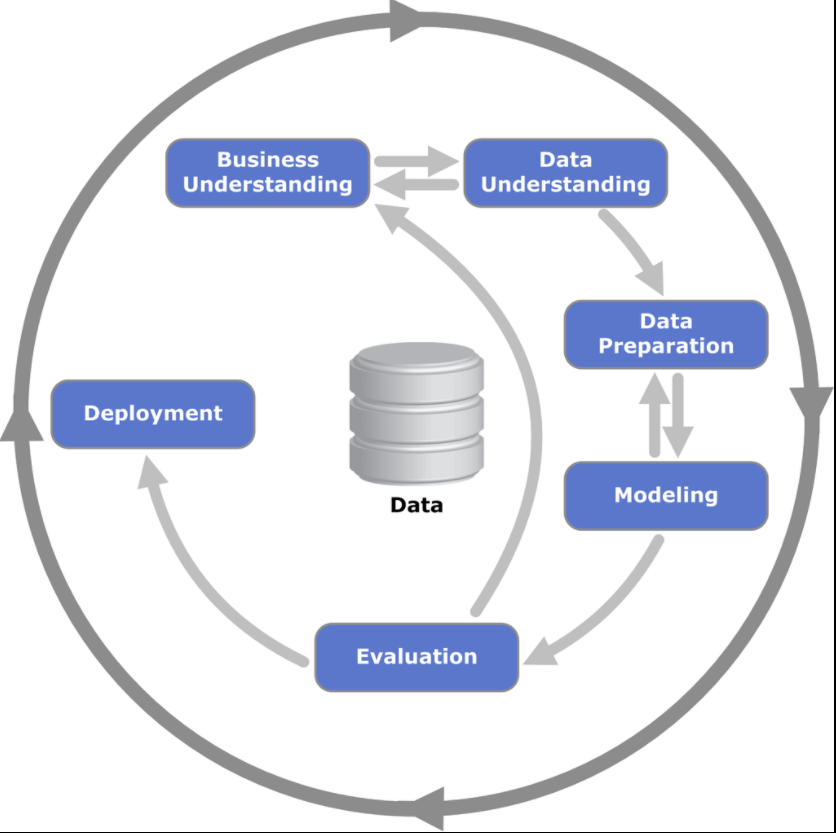

## STA2453: Data Science Methods, Collaboration, and Communication

The heart of this class is in understanding the workflow of data analysis from start to finish is . Primary class Objectives are:

- To introduce students to the skills required to work as a data scientist in industry or academia
- To gain experience using data analysis to extract information.
- to gain experience communicating information that arise from a data analysis.

## Learning outcomes

- Problem Formulation
- Data collection and understanding
- Data wrangling
- Programming ([R](https://cran.r-project.org)/[Python](https://www.python.org))
- Data exploration
- Data vizualization
- Modelling
- Communication
- Reproducibility

## Me!

- Currently the Director of Advanced Analytics at Data Science and Advanced Analytics (DSAA) for Unity
Health Toronto
- Work with a team of data scientists and engineers to solve problems that either:
  1. Improve Patient Outcomes
  2. Improve Hospital Efficiency
- We work with both R and python for analytical work with an emphasis on R:
  - Each project is an R package
  - We have Rstudio Pro for serving apps and dashboards
  - We use Rstudio Server pro for our IDE and for creating Jupyter notebooks

## Examples of work at DSAA

Example projects:

- Emergency Department volume forecast
- Nursing Resource Team (NRT) size optimization
- Capacity Optimization Bed Relief Analysis (COBRA)
- COVID dashboard
- GIM early warning systems

## ED forecasting Dashboard

- *Problem*: We experience surges in volumes throughout the year. Due to staffing
this has impacts on our ability to treat patients efficiently. 
- *Solution*: We will forecast ED arrivals days to weeks in advanced so proper staff
planning can take place. 
- *Data*: 
  - Emergency Department arrivals for 4 years
  - Holiday and event indicators
  - Weather forecasts
- *End Product*: We developed forecasting models for arrivals in 6 hour intervals for 3 days and daily
arrivals for a week in advanced. We provide a dashboard in the ED to display these forecasts

## Nursing Resource Team (NRT) Size Optimization

- *Problem*: Nurses call in sick or go on leave. The hospital has to call agencies or use overtime to replace
these nurses. This is expensive and leads to bad care. We developed a Nursing Resource Team (NRT), like an 
in house agency. They work regular shifts but only replace sick calls. How many do we hire?
- *Solution*: We can determine demand from past sick calls. We can then optimize the required staffing levels
- *Data*: 5 years of historical HR data giving us information on each shift missed
- *End Product*: We provided an application so that end users can play around with assumptions

## COBRA

- *Problem*: The hospital experiences what is known as a bed escalation; a shortage of beds to meet
incoming demand, a *THIRD* of the time. This results in delays in care and stress on the system.
- *Solution*: We can attempt to forecast when a bed escalation will occur, along with information
to help determine the main culprits. 
- *Data*: 
  - 3 years of historical volumes
  - 3 years of surgical schedules
  - 3 years of labeled outcomes (bed escalation/no bed escalation)
- *End Product*: An email to hospital executives and bed managers every night forecasting the next 3 days

## COVID Dashboard

- *Problem*: The hospital is hit with a new reality during a global pandemic. Hospital resources 
are shifted like they never have been before. We need to closely monitor COVID cases and patient volumes
throughout our 3 hospitals. 
- *Solution*: To build a near real time dashboard displaying volumes throughout all 3 hospitals
- *Data*: This was a complex data pipeline involving:
  - real time volumes at each hospital
  - COVID lab results
  - patient outcomes
  - bed cleaning information
- *End Product*: A dashboard displayed throughout the hospital updating as lab information comes in

## GIM risk prediction

- *Problem*: Up to 10% of patients in the General Internal Medicine (GIM) ward go to the ICU 
or die. If clinicians had advanced warning as to which patients were deteriorating, they could intervene.
- *Solution*: Develop an early warning system to forecast which patients are deteriorating
- *Data*: 7 years of historical
  - labs
  - vitals
  - medications
  - notes
- *End Product*: A complex intervention involving alerts generated from the model 3 times a day. 

## What the projects have in common

- In each case the analytical solution and output was very different.
  - Descritive: COVID dashboard
  - Predictive: GIM risk prediction, ED forecasting, COBRA
  - Prescriptive: NRT optimization
- The two things each project had in common
  - Very heavy data understanding, cleaning, and analysis
  - Communication with business leads and clinicians to understand the data and
  communicate results
  

## What is a Data Science Project?

> ... data analysis, which I take to include, among other things: procedures for analyzing data, techniques for interpreting the results of such procedures, ways of planning the gathering of data to make its analysis easier, more precise or more accurate, and all the machinery and results of (mathematical) statistics which apply to analyzing data.
>
> Data analysis ... take on the chracteristics of a science rather than those of mathematics ...
> `r tufte::quote_footer('--- Tukey, The Future of Data Analysis')`

## Steps in Data Analysis

If one were to write down the steps in a data analysis, you might come up with something along these lines of the following list

> - Defining the question
> - Defining the ideal dataset
> - Determining what data you can access
> - Obtaining the data
> - Cleaning the data
> - Exploratory data analysis
> - Statistical prediction/modeling
> - Interpretation of results
> - Challenging of results
> - Synthesis and write up
> - Creating reproducible code

## CRISP-DM

The steps from the previous slide can be organized into a very flexible methodology for designing data science projects known as the Cross-industry Process For Data Mining (CRISP DM). 

## Step 1: Business Understanding

THe project planning phase

> - Usually presenting with a problem. Can it be solved with data?
> - Is a data solution really necessary? Perhaps it's a process issue. 
> - Has anything else ever been attempted before?
> - What kind of solution does the problem require?
>  - Some data analysis with interpretations?
>  - A dashboard?
>  - An application embedded into a workflow?
> - How does our proposed solution affect other areas of the business?
> - How will we determine if our solution is successful? Evaluation metrics, cost benefit etc...

## Step 2: Data Understanding

The data extraction and understanding phase

- What data is available?
  - experimental vs observational data
- General description of the data (amount, frequency, access)
- Data exploration (counts, distributions, etc...)
- Data validation

## Step 3: Data wrangling/cleaning

This is where the data is prepared for analysis

- Splitting the data into training and testing sets
- Data pre-processing steps
  - applying transformations, merging tables
- Feature creation

## Step 4: Modelling

- Select modelling techniques
- Fit model and tune hyperparameters
- Assess model fit

## Step 5: Evaluation

This is where you critically evaluate the model performance

- Do the results make sense?
- Do the performance metrics meet or exceed expectations set up during the business understanding step?
- Have we evaluated the model on production data? Often data used for training can look different than the 
data available during production

## Step 6: Production and Deployment

- Building a deployment application: dashboard, shiny app, report, etc...
- Develop monitoring plan
- Often includes building a monitoring dashboard as well
  - Can monitor changes in inputs and outputs over time
- Develop training materials

## The process is cyclical 

At any stage in the process you may be required to go back a step or 2, or 3...

<iframe src="https://giphy.com/embed/3oFzlY0DO131GoCFva" width="480" height="270" frameBorder="0" class="giphy-embed" allowFullScreen></iframe>
<a href="https://giphy.com/gifs/hells-kitchen-fox-foxtv-3oFzlY0DO131GoCFva">via GIPHY</a>

## Data wrangling tutorial

LAB TIME

