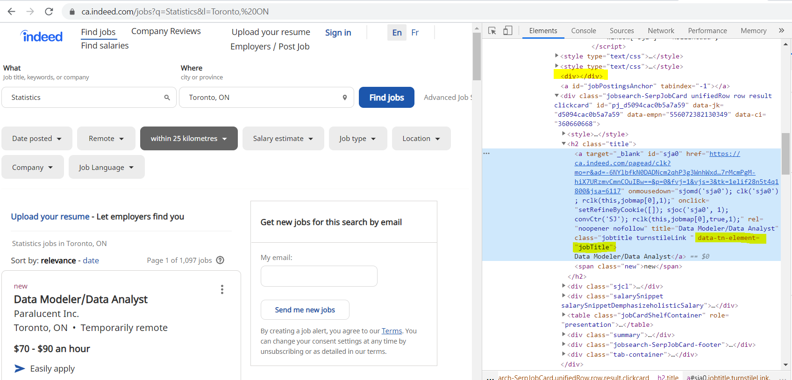

  
# Introduction
  
We need to interact with some web-pages to scrape the data we are interested in. Thus far we have dealt with web pages that are static. In this section we will interact with the jobs website [indeed.ca](indeed.ca) to extract potential jobs we can apply for. When we go to indeed.ca, we are faced with the following page


<br>


```{r, echo=T, warning=F, message=F}

# load libraries
library(dplyr)
library(rvest)
library(ggplot2)

# the url for the session

url <- "https://ca.indeed.com/"


# We can simulate a session in a browser

html <- url %>% 
  html_session()

```

`html_session()` is like opening a browser on that webpage. We can extract potential forms to fill out by using `html_form()`


```{r}

# extract the form from the webpage

form_blank <- url %>% 
  read_html() %>% 
  html_form()

# What is this object
class(form_blank) # a list

# What is in the list
str(form_blank)

# What does it look like when we print it
print(form_blank)

# What fields are in this form
print(form_blank[[1]]$fields)


```


We can see that there are two fields to fill out in this form

- `q`: the job we want to query
- `l`: the location we want to query

We can fill out these fields using the `set_value()` function. Lets look for statistics jobs in Toronto Ontario. 

```{r}
form_filled = form_blank[[1]] %>%
  set_values(
    "q" = "Statistics",
    "l" = "Toronto, ON") 
```


Once we have filled out the form, we can submit it using `submit_form`. 


```{r}
submitted <- html %>% 
  submit_form(form_filled)

print(submitted)

```


You can see that we have moved to this url: `r submitted$url`. It has actually navigated to a page that looks like this:


<br>


Now we can proceed as we would before. We can start by extracting the job titles available on this page. In this case we are going to extract the element using xpath. We can pass an xpath search of the form ("//tagname[@attribute = 'value']). A quick look in the chrome developer tab shows us that we are looking for `data-tn-element = "jobTitle"` which is found wihin a `div` tag. The attribute we want from this is the `title` element. 

<br>



<br>

```{r}
job_title <- submitted %>% # from the submitted form
  rvest::html_nodes("div") %>% # get the div nodes
  rvest::html_nodes(xpath = '//*[@data-tn-element = "jobTitle"]') %>% # find nodes where data-tn-element = "jobTitle"
  rvest::html_attr("title") # extract the title attribute

job_title
```
  
Voila, we have extracted all the job titles from this page. If we also want to extract the location, we can simply find the nodes that have the class `.location`. Similarly, we can find the company for the posting in the `.company` nodes, and we can get the links to the jobs using xpath with `data-tn-element="jobTitle"` and extracting the `href` attribute. 

```{r}

job_locations <- submitted %>% 
  rvest::html_nodes(".location") %>%
  rvest::html_text()

job_company <- submitted %>% 
  rvest::html_nodes(".company") %>%
  rvest::html_text() %>%
  stringi::stri_trim_both()

# job links
job_links <- submitted %>% 
  rvest::html_nodes("div") %>%
  rvest::html_nodes(xpath = '//*[@data-tn-element="jobTitle"]') %>%
  rvest::html_attr("href")

# FYI we don't have to use xpath. We can search in the nodes as before with

# submitted %>% 
#   rvest::html_nodes("div") %>%
#   rvest::html_nodes('[data-tn-element="jobTitle"]') %>%
#   rvest::html_attr("href")

# we can pull the summary blurb of the job description by 
# extracting the summary class

job_blurb <- submitted %>%
  rvest::html_nodes('.summary') %>% 
  rvest::html_text() %>%
  stringi::stri_trim_both()

# put everything in a data.frame

jobs_data <- tibble(title = job_title,
                    company = job_company,
                    location = job_locations,
                    links = job_links,
                    blurb = job_blurb)

DT::datatable(jobs_data, caption = "scrapped jobs",
               options = list(scrollX = T))
```


If we want to, we can navigate to any of the job descriptions using `jump_to()` and pull the job description.


```{r}

# go to the page for the first job description
job1 <- submitted %>% jump_to(jobs_data$links[1])

# pull the text of the job descripion
job1 %>% 
  html_nodes('div') %>% 
  html_nodes('#jobDescriptionText') %>% 
  html_text()


```

