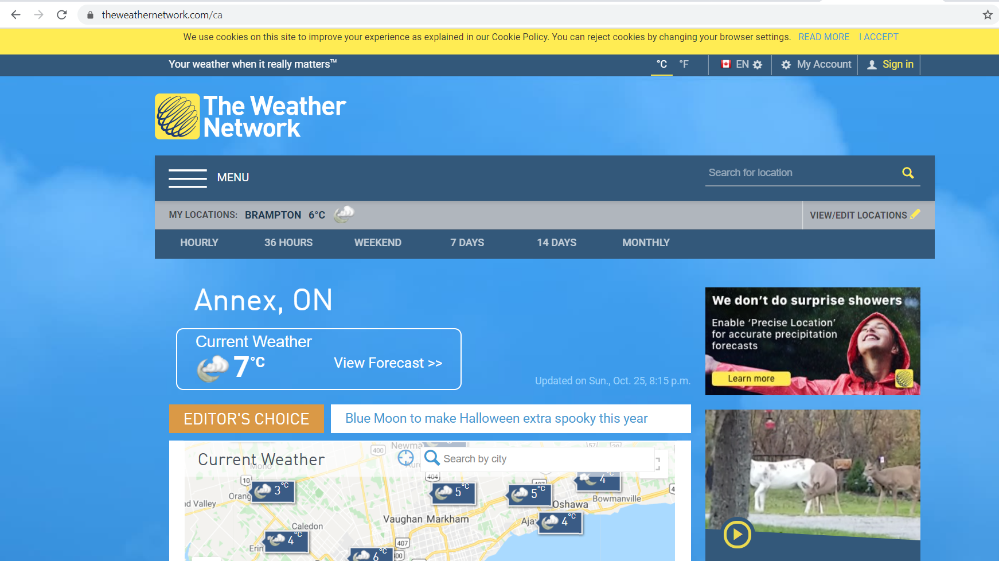
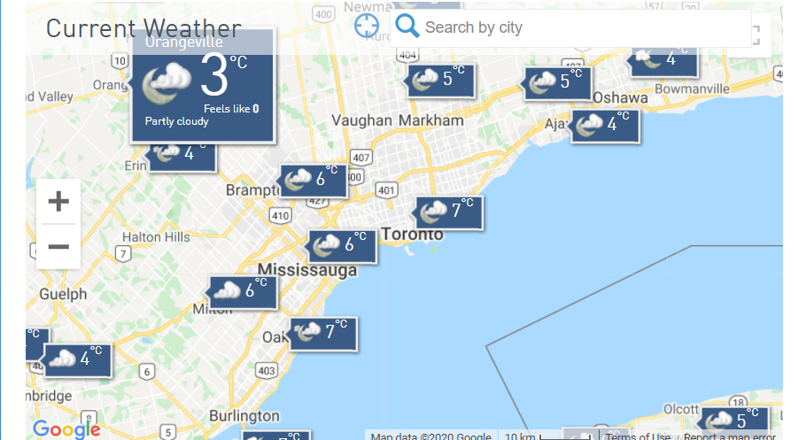
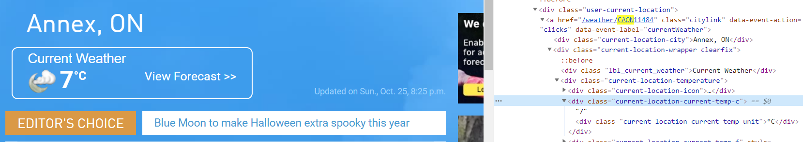
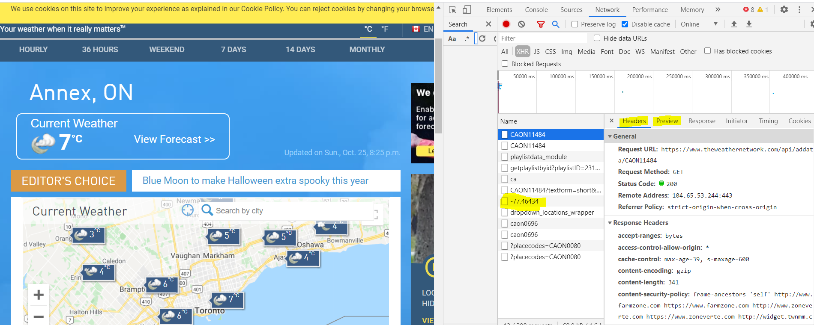
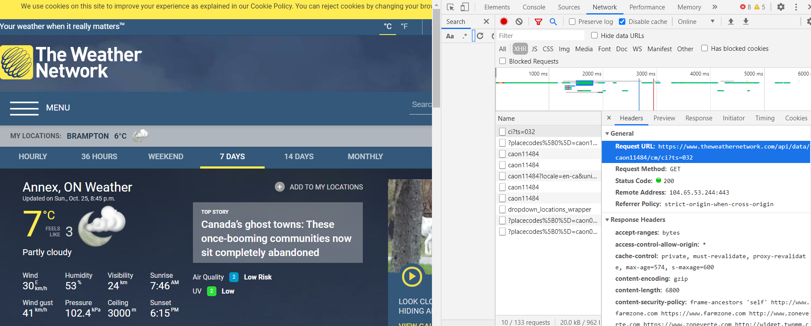
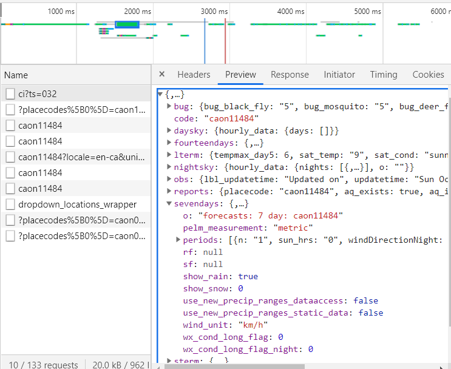

# Introduction

Server (back-end) facing data is data that is stored on a server, usually in a nice clean data base. You can usually tell when a data set is server facing because the data either takes time to load or the data changes while you are browsing (think weather forecasts updating)

## The problem

We are going to extract the weather forecast for a city of interest. The tutorial will show you how to find the location of the server's API that contains the data. 

## The website

Navigate to [http://theweathernetwork.com](http://theweathernetwork.com) and you will see the following

  


<br>

Specifically you can see a list of cities that we may want to extract forecasts for




<br>

Now we could proceed as before and right click to inspect any element as before



<br>

But many sites are actually pulling their data from some API that we can make use of. The inspect tab provides you with many tools for interacting with HTML documents. You can view the raw html code, and more importantly for our purposes, you can see the network trafic to the website.

Click on the Network tab and then refresh the page and see what is loaded. 



We see above a whole bunch of resources that have been loaded. For each resource you can click on the header and preview tabs (highlighted above within the network tab) to see what data is sent to the website. We are interested in resources that return data, usually in a json format. 

Exploring the first couple of resources above, we can see they are giving current weather, which is not quite what we want. If we click on the link for the first city we are presenting with when visiting the site, we will see something much more promising:





We see the link titled, `https://www.theweathernetwork.com/api/data/caon11484/cm/ci?ts=032` gives us exactly what we want! A json object with all of the data. Let's extract that data in R

```{r, echo=T, warning=F, message=F}
library(dplyr)
library(jsonlite)
library(rvest)
library(ggplot2)

url <- "https://www.theweathernetwork.com/api/data/caon11484/cm/ci?ts=032"

df <- jsonlite::fromJSON(url)

# what objects are in here

names(df)

# let's look at the seven day forecast

forecast7 <- df$sevendays

# also a lit
class(forecast7)

# what is in it
names(forecast7)

forecast7p <- forecast7$periods

DT::datatable(head(forecast7p), options = list(scrollX = T))

forecast7p %>% 
  mutate(n = as.numeric(n),
         metric_feelsLike = as.numeric(metric_feelsLike)) %>% 
  ggplot(aes(n, metric_feelsLike)) + 
  geom_line() + 
  ggtitle("Forecasted temperature for the next N days") 
```


This is fantastic because now we can access all of this data every day. The problem is that this is fairly limited because We would manually 
research what the link is each time we want to forecast data for a different city. Let's see if we can automate this.


<br>


Looking back at the image of when we first loaded the website, we see a resource loaded called `-77.46434`. This looks weird, but also looks like
maybe a latitude, or longitude. If we explore what is contained in the header, we get the following link

```{r}

url <- 'https://www.theweathernetwork.com/ca/api/maps/regional/9/45.06821/-81.34300/42.27356/-77.46434'

df <- jsonlite::fromJSON(url)

str(df)

df$id

df$name_en
```


and bingo! We get the ids of all the different cities. We can also see from the query that it looks like we are submitting some kind of bounding
box in terms of latitude, longitude. 

Let's write a function that grabs the station ids for a given longitude/latiude.

```{r}

get_station_ids <- function(lat1, lat2, lon1, lon2) {
  url <- glue::glue('https://www.theweathernetwork.com/ca/api/maps/regional/9/{lat1}/{lon1}/{lat2}/{lon2}')
  df <- jsonlite::fromJSON(url)
  
  station_ids <- df %>% 
    select(name = name_en, id)
  
  return(station_ids)
}
  


```


Let's try this function with my home province (New Brunswick). 

Here are the bounding boxes (lat and lon) of the Canadian provinces


```{r, echo=T}
nb_station_ids <- get_station_ids(lon1 = "-69.06",
                                  lon2 = "-63.77",
                                  lat1 = "44.60",
                                  lat2 = "48.07")

```


Now we can write a generalized function to get forecasts for a city we want to know more about


```{r}

get_city_7d_forecast <- function(station_id) {
  
  url <- glue::glue("https://www.theweathernetwork.com/api/data/{station_id}/cm/ci?ts=032")
  
  df <- jsonlite::fromJSON(url)
  
  forecast7 <- df$sevendays$periods
  
  return(forecast7)
  
}

```


If we want we can get the forecast for every city in NB.

```{r}

all_forecasts <- list()

nb_station_ids <- nb_station_ids %>% 
  slice(1:15)
for(i in 1:nrow(nb_station_ids)) {
  
  tmp <- get_city_7d_forecast(nb_station_ids$id[i])
  tmp <- tmp %>% 
    mutate(city = nb_station_ids$name[i],
           city_id = nb_station_ids$id[i]) %>% 
    select(city, city_id, everything())
  
  all_forecasts[[nb_station_ids$name[i]]] <- tmp
  
  # sleep for a couple of seconds to be kind/mindful of their servers
  
  cat("Downloaded data for city", nb_station_ids$name[[i]], "\n")
  Sys.sleep(2)
  
}

all_forecasts_df <- do.call(rbind, all_forecasts)


all_forecasts_df %>% 
  mutate(metric_feelsLike = as.numeric(metric_feelsLike)) %>% 
  ggplot(aes(city, metric_feelsLike)) + 
  geom_boxplot() + 
  coord_flip() +
  ggtitle("Distribution of weather over the next 7 days")
```


## Summary

It takes some playing around/exploring to find what you are looking for. The best way to learn this stuff is through trial and error. 
I suggest picking a website you like and trying to extract some data from it (as long as it isn't forbidden by the site).


