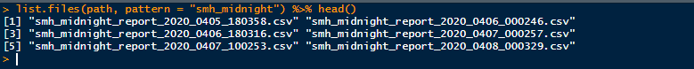

<style type="text/css">
  .reveal p {
    text-align: left;
  }
  .reveal ul {
    display: block;
  }
  .reveal ol {
    display: block;
  }
</style>

## Objectives

- Beginning a new project
  - File/Folder structure
  - File naming
  - File paths
- Introduction to Git
- Using git with Github

<iframe src="https://giphy.com/embed/1MayKbFuSKE1O" width="480" height="324" frameBorder="0" class="giphy-embed" allowFullScreen></iframe><p><a href="https://giphy.com/gifs/dogs-pool-teamwork-1MayKbFuSKE1O">Teamwork!</a></p>

## New Project setup

- `README.md`
- `.gitignore`
- `project.Rproj`
- `data/`
    - `raw_data/`
    - `clean_data/`
    - `data_references`
- `code/`
- `figures/`
  - `exploratory_figures/`
  - `explanatory_figures/`
- `products/`
  - `writing/`

## README.md {#smallfont data-transition="zoom"}

This is a very important file. The README file displays as the homepage
on any git hosting platform (e.g. github). You use it to:

> - Introduce the reader to the project
> - Give instructions on how to set up the project.
  > - e.g. clone repo, run `renv::restore()`, etc...
> - Give instructions on which files to fun in which order
  > - Run `clean_code.R` ingest raw data and do basic cleaning
  > - Run `prepocess_data.R` to prepare the data for modeling
  > - `utils.R` contains helper functions required for the analysis
  > - `descriptive-report.Rmd` creates the html report with our exploratory analysis
> - Give instructions on how to contribute to the repo

## .gitignore

This important file tells you which files to ignore when pushing to Github to ignore when you are pushing to the web:

- Usually raw/sensitive data 
- Large files
- Any file that might contains passwords, tokens, etc...

<iframe src="https://giphy.com/embed/IdmfEtnMWPzOg" width="480" height="273" frameBorder="0" class="giphy-embed" allowFullScreen></iframe><p><a href="https://giphy.com/gifs/ron-swanson-ignore-parks-and-rec-IdmfEtnMWPzOg"></a></p>
  
## .gitignore format

A gitignore file specifies intentionally untracked files that Git should ignore. It is a plain text file where:

- blank lines are used to separate entries
- a \# can be used for comments
- "/" denotes a directory separator
- An asterisk "*" matches anything except a slash. The character "?" matches any one character except "/". The range notation, e.g. [a-zA-Z], can be used to match one of the characters in a range. 

see [here](https://github.com/github/gitignore/blob/master/R.gitignore) for an R gitignore file.
see [here](https://github.com/github/gitignore/blob/master/Python.gitignore) for a Python gitignore file.

```{bash, eval=F}
# no .csv files
*.csv
#no R data files
*.Rda
```


## Data Folder

This folder should contain:

- `Raw data/`

- `Clean data/`

- Description files which contain a data dictionary (if it exists), along with
instructions on how to get from raw data to clean data


## Code folder {#smallfont2 data-transition="zoom"}

When you first get your hands on data, you may be tempted to write a bunch of quick and dirty code
to explore the data. This is okay! Store it in the `code/raw_code` folder. This folder is for you!

In the `code/final_code` folder, we store the code which is

- Organized
- Easy to follow
- Reproducible

<iframe src="https://giphy.com/embed/LmNwrBhejkK9EFP504" width="480" height="380" frameBorder="0" class="giphy-embed" allowFullScreen></iframe><p><a href="https://giphy.com/gifs/memecandy-LmNwrBhejkK9EFP504"></a></p>


## Figures

- `figures/exploratory_figures`: This are quick and dirty plots to explore the data, understand its
structure, and get a sense of relationships between variables
- `figures/explanatory_figures`: Polished final figures that you will share with others. These are generally
ordered and help tell the story of your final data analysis.

<iframe src="https://giphy.com/embed/l2JdSDAAwdtVa4bzW" width="480" height="360" frameBorder="0" class="giphy-embed" allowFullScreen></iframe><p><a href="https://giphy.com/gifs/season-12-the-simpsons-12x9-l2JdSDAAwdtVa4bzW"></a></p>

## Products folder

This folder is used for storing your manuscripts (`/writing`) or any apps, dashboards you build. I would only include simple apps, dashboards that supplement the analysis. Full app/dashboard products should go in their own project and folder structure. 

<iframe src="https://giphy.com/embed/WoWm8YzFQJg5i" width="480" height="351" frameBorder="0" class="giphy-embed" allowFullScreen></iframe><p><a href="https://giphy.com/gifs/cartoons-comics-sea-reading-WoWm8YzFQJg5i"></a></p>

## File naming {data-background="filenaming.png" data-background-size="700px 700px"}


## File naming

I take my philosophy from Jenny Bryan, who says that file names should be

1. Human readable
2. Machine readable
3. Plays well with default ordering


## Machine readable

- Regular Expression friendly
  - No spaces, 
  - No punctuation
  - No accented characters
  - Case sensitive
  
<br>


## Human readable

- The file name contains info on its content:
- Should be able to figure out what something is based on its name
- Err on the side of long names

```{r, echo=F}

bad_names <- c("Josh's Lecture Notes.html",
               "JoshMurrayReport.Rmd",
               "Final Report!.Rmd",
               "FinalReportGIMprojectv2.Rmd")
good_names <- c("josh_lecture_notes.html",
                "josh-murray-report.Rmd",
                "final-report.Rmd",
                "final_report_gim_project_v2.Rmd")

knitr::kable(data.frame(bad_names, good_names))

```

## Relative paths

When working on a project together, you are going to have to share files/data. When
sharing files (e.g. through github), the files are no longer on your computer. Therefore,
paths like:

`C:/Users/Josh/Projects/GIM-risk-score/code/01_clean_data.R`

Won't exist on a collaborators computer. This is where the [here package](https://cran.r-project.org/web/packages/here/index.html) can help!

## here package

- The here package looks for a `.Rproj` file and points to that directory

- You can use the here function to define paths in your code to code or data files
  - e.g. `here('code', 'raw_code', '01-explore-raw-data.R')`

<iframe src="https://giphy.com/embed/3oEjHZ0YoZeHila4qA" width="480" height="242" frameBorder="0" class="giphy-embed" allowFullScreen></iframe><p><a href="https://giphy.com/gifs/producthunt-self-driving-cars-autonomous-product-hunt-3oEjHZ0YoZeHila4qA"></a></p>


## Coding Style

Having a clean and consistent coding style helps collaborators understand your
work more easily. Collaborating is much easier when there are consistent rules for
naming variables, functions, etc..

There are many approaches to styling code

- [Googles R style guide](https://google.github.io/styleguide/Rguide.html)
- [Tidyverse R style guide](https://style.tidyverse.org/)
- [bioconductor style guide](https://bioconductor.org/developers/how-to/coding-style/)
- [Google's Python style guide](https://google.github.io/styleguide/pyguide.html)
- [PEP 8 style guide for Python](https://www.python.org/dev/peps/pep-0008/) 

# Reproducibility

## Dev {data-background="development.png"}

## environments {data-background="renv.png"}

## renv

The general workflow when working with renv is:

1. Call `renv::init()` to initialize a new project-local environment with a private R library,

2. Work in the project as normal, installing and removing new R packages as they are needed in the project,

3. Call `renv::snapshot()` to save the state of the project library to the lockfile (called renv.lock),

4. Continue working on your project, installing and updating R packages as needed.

5. Call `renv::snapshot()` again to save the state of your project library if your attempts to update R packages were successful, or call `renv::restore()` to revert to the previous state as encoded in the lockfile if your attempts to update packages introduced some new problems.

## config files/environment variables {data-background="config.png"}


# Version Control with git and github 

## Version Control {data-background="version-control-image.gif" data-background-size="800px 800px"}

## Why git {data-background="why-git.png" }

## Why Git and github?

- Git is a version control system for tracking changes in a set of files
called a *repository* in a structured way
- We can use git to manage all of the files in the folder structure we have
specified here: code, figures, manuscripts, etc...
- New users to Git will struggle with the new workflow that accompanies it.
- The greatest benefits to using Git come from collaborating in a team setting
- *Github* is a hosting service that creates an online home for your repository
  - It allows others to see your work, and maybe even make changes if you allow

## What are the benefits?

- A way to display your work to potential employers
- If you need to work together on a project (hint hint). Individual team memebers work
independently and then reconcile changes and share results with github
- To learn from others! Github is a great way to see the nuts and bolts of 
the packages you use, or the cool code someone created to analyse a dataset you care 
about. 

## Registering a github account

- You can register an account for free at [github.com](github.com)
- Select a username. Some advice from Jenny Bryan:
  - Incorporate your name somehow
  - reuse your username from other public accounts (e.g. twitter)
  - Pick a name that you won't feel embarrassed saying out loud to colleagues
  - make it timeless. Don't highlight your current position/school
  - It's highly recommended that you use all lowercase letters
  - Don't pick usernames that are common programming words

## Checking if git is already installed

Check to see if it is already installed, run `where git` (windows), `which git` (linux)
to see where the executable is located. You can run terminal commands in R using `system()`

```{r, echo=T}
# Where is git installed
system("where git")

# which version of git is installed
system('git --version')
```
  
If these return anything, fantastic news. You already have git successfuly installed. 

## Installing git


- Installing on Windows: install [Git for windows](https://git-for-windows.github.io/). This will
install "Git Bash" a useful command line tool. 

- On Ubuntu or Debian Linux: `sudo apt-get install git`

- On Redhat Linux: `sudo yum install git`

- On Mac: `xcode-select --install`

## Getting started with Git

You can set your github username and email at the terminal with the following:

```{bash eval=F}
# set username
git config --global user.name 'Jane Doe'
# set email address 
git config --global user.email 'jane@example.com'
# check display
git config --global --list
```

Or with R using the `usethis` package

```{r eval=F}
usethis::use_git_config(user.name = "Jane Doe", user.email = "jane@example.org")
```

## Git workflow basics (solo)

Using git isn't all that different from your usual workflows.

- **Pull** any changes that were made to the code.
- **Add** your changes (to the launching pad).
- **Commit** your changes (from the launching pad to the Moon).
- **Push your** changes (from the Moon to Mars).


<iframe src="https://giphy.com/embed/cnhpl4IeYgU7MCBdV2" width="272" height="380" frameBorder="0" class="giphy-embed" allowFullScreen></iframe><p><a href="https://giphy.com/gifs/david-cava-production-github-staging-cnhpl4IeYgU7MCBdV2"></a></p>

## Git workflow (when working with others)

- **Pull** any changes
- <span style="color: red;">Create a new branch (recreate the space station in a parallel universe)</span>
- **Add** your changes (to the launching pad of your parallel universe space station).
- **Commit** your changes  (to a Moon in a parallel universe).
- **Push** your changes (from the parallel universe Moon to a parallel universe Mars)
- Create a **pull request** (or PR) (from parallel universe Mars to real verse Mars)


## Git pull

You can pull the most recent changes to the repo with `git pull`.

```{bash eval=F}

# pull the most recent changes

git pull

```

## Git log

You can see the commit history with `git log`.

```{bash eval=F}

# pull the most recent changes

git log

```

## Git status

After working on your code and making changes, you can examine which files have changed with 1git status`. 
This allows you to check in on the status of the repo.

```{bash eval=F}

# check for any changes

git status

```

## Adding changes to the staging area

When you have saved changes in your working directory, you can add them to the staging
area with `git add`

```{bash eval=F}

git add -A

```

The `-A` is an option which says to add all changes


## Commit messages {data-background="commit-messages.png" data-background-size="800px 600px"}

## Writing good commit messages

from [https://chris.beams.io/posts/git-commit/](https://chris.beams.io/posts/git-commit/)

1. Separate subject from body with a blank line
2. Limit the subject line to 50 characters
3. Capitalize the subject line
4. Do not end the subject line with a period
5. Use the imperative mood in the subject line
6. Wrap the body at 72 characters
7. Use the body to explain what and why vs how

## Making a commit

After you have staged some changes with `git add -A`, you can commit these
changes with `git commit`

```{bash eval=F}

git commit -m "initial commit"

```

the `-m` option specifies that you are adding a commit message

## Pushing changes to the remote repo

You can push changes in your local repo to the remote repo with 
`git push`

```{bash eval=F}

git push -u origin master

```

In the above origin is the name of the remote repository and master is 
the name of the branch you are pushing. 

## Demos

We will walk through the following demos

- Creating a local git repo from the command line
- Working with github
- Branching and Pull requests
  - Code review
- Fixing common mistakes


