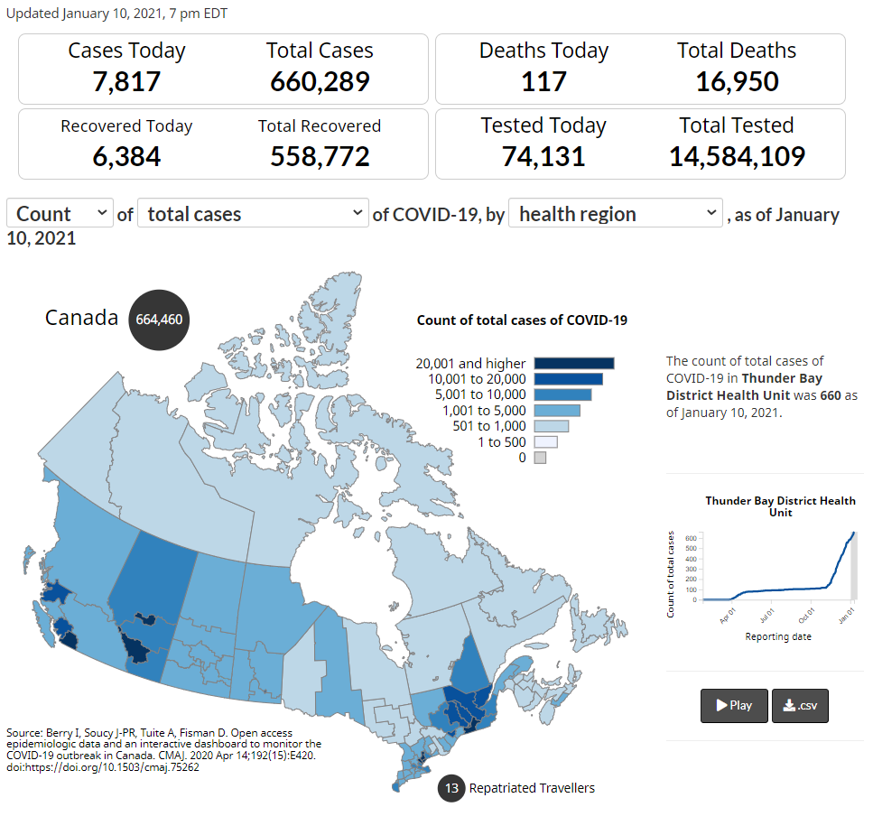
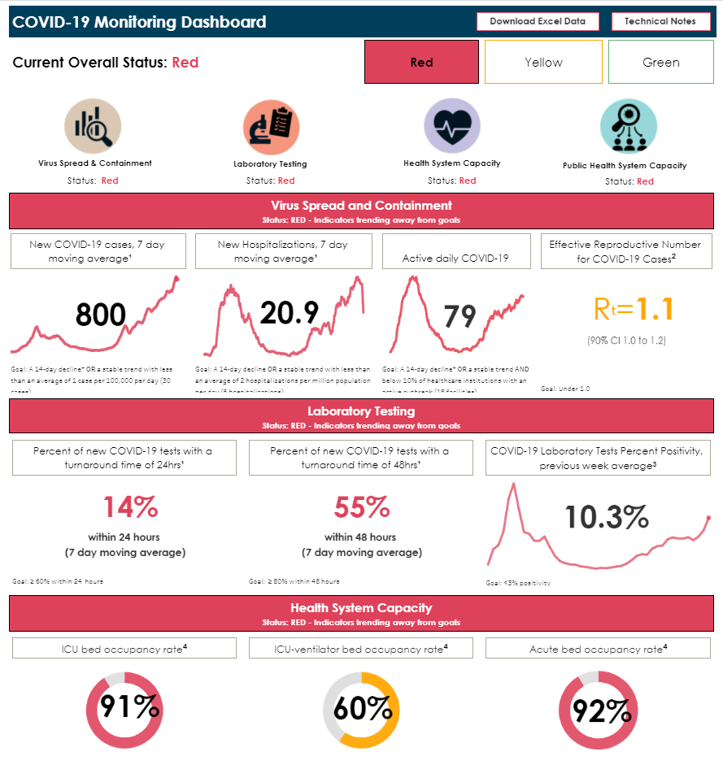
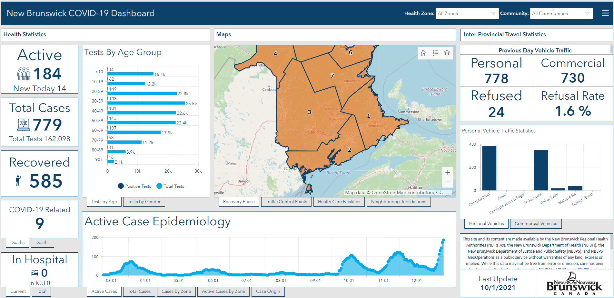
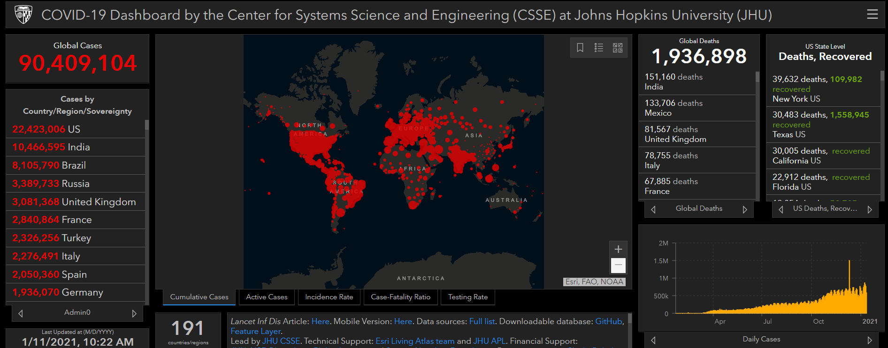
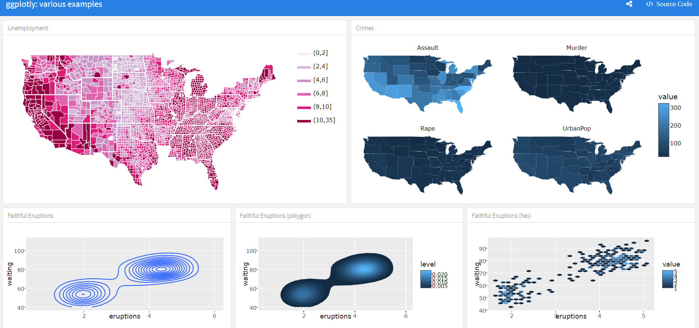

```{r setup, include=FALSE}
knitr::opts_chunk$set(echo = TRUE)
```

# Background

So, you've completed some fancy analysis and/or built some model for a client. Now what? Years ago, writing a report may have been the final stage of such a project. This is often an underutilization of the information obtained from an analysis. We now have access to many open source (and proprietary tools) that allow us to: 1) share our results more easily to a wider audience, and 2) Allow end users to interact with our results.  

Building compelling visualizations to present data to various audiences is a
highly valuable skill for data scientists and one that we will work on with this project. Students will be split into groups of 2/3 and will build a functional dashboard along with a 2-3 page descriptive report.  

# Question

Since the Covid-19 pandemic began, Ontario public health has been collecting several important data points to help advise decision makers and to better inform the public. Thankfully, many of these data sources have been made fully public. 

Several Covid-19 dashboards have been made by different public health agencies.

### Government of Canada Dashboard

[Government of Canada Covid-19 Dashboard](https://health-infobase.canada.ca/covid-19/dashboard/)



### Toronto Public Health Dashboard

[Toronto Public Health](https://www.toronto.ca/home/covid-19/covid-19-latest-city-of-toronto-news/covid-19-status-of-cases-in-toronto/)



### New Brunswick Public Health Dashboard

[Province of New Brunswick Covid Dashboard](https://experience.arcgis.com/experience/8eeb9a2052d641c996dba5de8f25a8aa)



### John Hopkins Dashboard

[John Hopkins Dashboard](https://experience.arcgis.com/experience/8eeb9a2052d641c996dba5de8f25a8aa)




# Assignment

The assignment is to:

1. Build a functional COVID-19 dashboard that could:
  - Ingest data on a daily basis
  - Provide a visual display of important features in the data
2. Write a 2-3 page report describing your dashboard:
  - The intended audience of the dashboard
  - Description of the dashboard pipeline (data ingestion, cleaning, display, framework, etc...)

This project will not involve a formal presentation to the class. The deliverables are a 2-3 page report along with a github repository containing the code and dashboard. The README of the dashboard should provide instructions on how to use the repository to generate the dashboard. 

NOTE: I say above that the dashboard should be able to ingest data daily. I don't mean that you should actually productionize your dashboard on some server where it is ingesting data daily. I mean that your dashboard should include the code for that functionality. 

Your group will have several choices to make:

1. The data you will use (more information below)
2. The intended audience
3. The technological framework (more below and in next lecture)


## The Data

The data you use and the intended audience is fairly open ended. If you are having any trouble coming up with something, or just want to make sure you are on the right track, please check in with me. 

### Data resources


#### John Hopkins Github Repository

The John Hopkins github repository is an excellent reference for all of the available data. 

[John Hopkins data](https://github.com/CSSEGISandData/COVID-19)

#### Government of Ontario Covid-19 Case Data
The Ontario Government, provides fairly straightforward access to their data

[Government of Ontario Covid-19 case data](https://covid-19.ontario.ca/data)

#### Open Data Toronto Covid-19 cases

Open Data Toronto, provides very easy access to the data especially for developers. 

[Open Data Toronto Covid 19 Cases](https://open.toronto.ca/dataset/covid-19-cases-in-toronto/)

```{r, echo=T, warning=F, message=F}
	
library(opendatatoronto)
library(dplyr)
 
# get package
package <- show_package("64b54586-6180-4485-83eb-81e8fae3b8fe")
package
 
# get all resources for this package
resources <- list_package_resources("64b54586-6180-4485-83eb-81e8fae3b8fe")
 
# identify datastore resources; by default, Toronto Open Data sets datastore resource format to CSV for non-geospatial and GeoJSON for geospatial resources
datastore_resources <- filter(resources, tolower(format) %in% c('csv', 'geojson'))
 
# load the first datastore resource as a sample
data <- filter(datastore_resources, row_number()==1) %>% get_resource()

DT::datatable(head(data), options = list(scrollX=T))

```


## Audience

You can also select the intended audience of your dashboard. Some examples might include

1. The General Ontario public
  - How many cases in different locations of ontario? Areas with high case counts
2. Ontario decision makers
  - In addition to info from (1), hospital utilization
3. The General Canadian Population
  - Case counts by province, provinces with high transmission rates
4. The general world population
  - Case counts by country, countries with high transmission rates

Your report should describe your intended audience. That is, who are you trying to inform, what important information are you trying to relay, and how could they use it?

## The Technological Framework

The framework consists of the tools you use to ingest, clean and display the data. The choice is entirely up to you, however I would ask that you refrain from using point and click frameworks (i.e. Tableau, PowerBI). Below I provide a few examples (I will cover a few of these in class):

### R and Flexdashboard

The [flexdashboard](https://rmarkdown.rstudio.com/flexdashboard/) R package provides a very simple way to make professional dashboards using simple Rmarkdown. 



Flexdashboard allows you to quickly build dashboards, but at the expense of more limited flexibility. Limitations include, strict layout rules and limited reactivity. For more reactive dashboards with R, you can use:

### R and Shiny

Shiny is an R framework for building fully interactive web applications. Apps can be fully customized but requires more effort in learning the language. I will cover shiny 

### R and Shiny dashboard

Shinydashboard is an R shiny package specifically designed for creating dashboards. I will cover flexdashboard, Shiny, and shinydashboard in the next lecture.

## Python and Dash

The python alternative to building a dashboard is the [dash plotly package](https://dash.plotly.com/). Dash also has a learning curve to it, but is capable of building beautiful fully interactive dashboards.  

[Dash library](dash.PNG)

### Javascript frameworks

In addition frameworks with R and Python, you could use any javascript library to build a browser based dashboard. Here are a couple of interesting tutorials:

- [Building a realtime analytics DASHBOARD with Node.js and Mongodb](https://morioh.com/p/43bcbd81a287)
- [Building a Covid-19 dashboard with nodejs](https://dev.to/puf17640/building-a-covid19-dashboard-nodejs-4g4)

The downside of using a javascript framework is needing to build a backend database to interact with. 

## Groups

Students will be randomly divided into groups of three/two.  Each group will hand in a 2-3 page written report along with the github repository used to build their dashboard. 

## Written Report

The written report for this project will be a 2-3 page write-up. The write-up should describe:

- The intended audience for your dashboard
- The Data you used to make the dashboard
- The reason you selected the visualizations you included
- How an intended user could use the dashboard
- The technological framework you used (i.e. R and flexdashboard)
- What did you learn, any future directions you could take the project if
you had more time. 

The report does not need to include any code. 
The written report and dashboard repository is due on February 23rd. 


## How will I be evaluated?

Good question. For this project the dashboard and github repository will be worth 70% of the grade, with the remaining 30% going to the written report. 

### Writing evaluation

Your writing will be evaluated for clarity and conciseness. 

1. Title [1-5]
There should be an appropriate title, adequate summary, and complete information including names and dates.

2. Introduction [1-5]
Clearly state the goal of your dashboard along with the intended audience. 

3. Data and methods [1-10]
Clearly describe the data pipline for your project. How are you extracting and cleaning the data. Specify important decisions you made along the way.

4. Dashboard framework and visuals [1-10]

Describe the dashboard framework you chose and why. Describe how the dashboard interact with the data and how a user can interact with the dashboard. Describe the visuals you chose to use and why. 


5. Conclusion / Discussion [1-5]

Discuss the results of your dashboard. Are you satisfied with your end product? What did you learn along the way and what would you do if you had more time. 


## Code and visuals

The code and dashboard itself are worth a combined 70%. This is further broken down so that the dashboard is worth 45 of the 70 and the code/github repo is worth 25 of the 70. 


### Code evaluation

The github repository should include a README file which describes how to use the dashboard to either create or view the dashboard along with a description of the analytical pipeline:

- Where and how you access/clean the data
- The framework for the dashboard
- How the data is ingested into the dashboard

The general grading rubric from the assignments will be used to assess your code. If you have any questions, please reach out. 


### Evaluation of visuals

- After reading your report to understand the intent and audience, I should be able to look at your visuals
  without further assistance.
- Graphs should have clear labels, axis titles, and legends (if necessary)
- The overall layout should make sense. Be sure to not make the dashboard too cluttered
